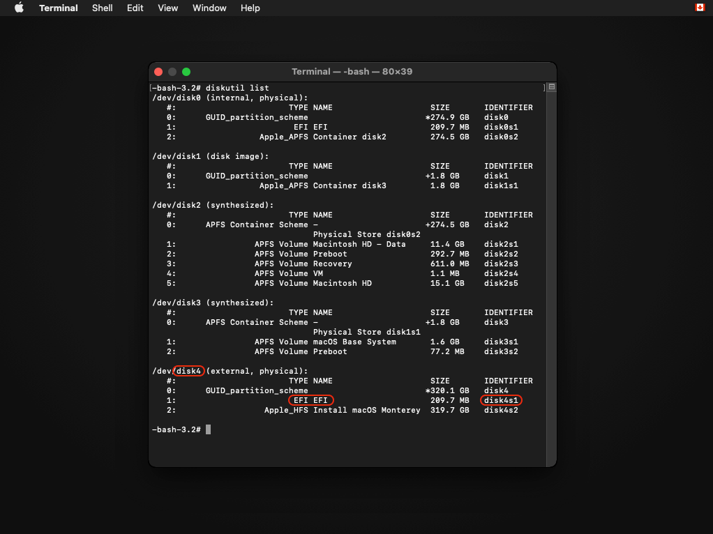
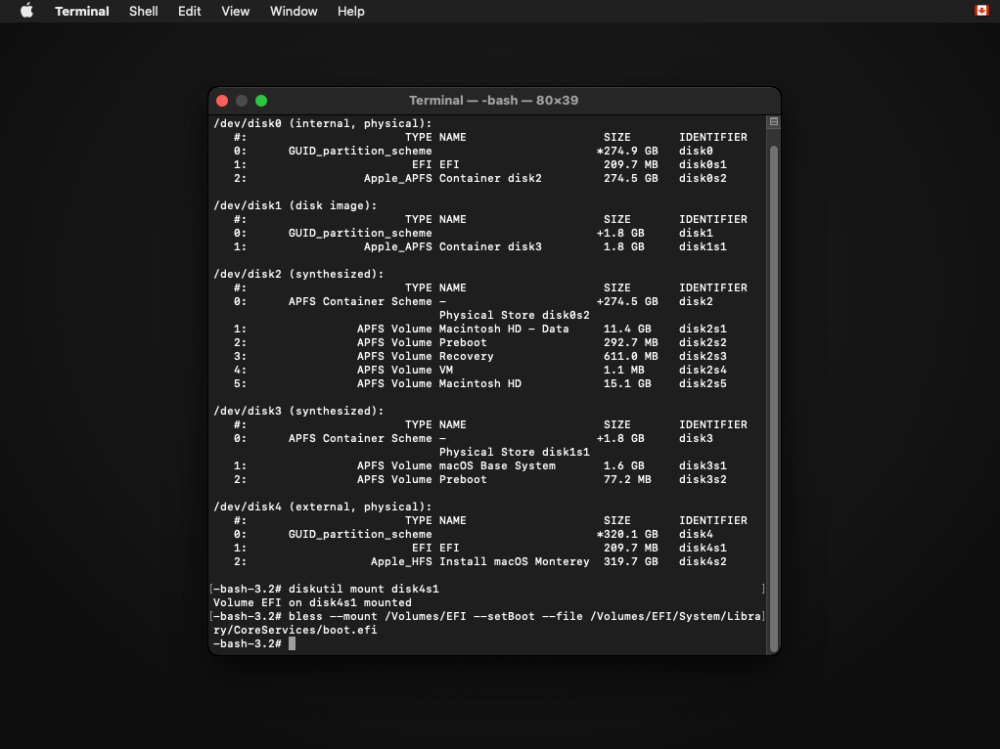
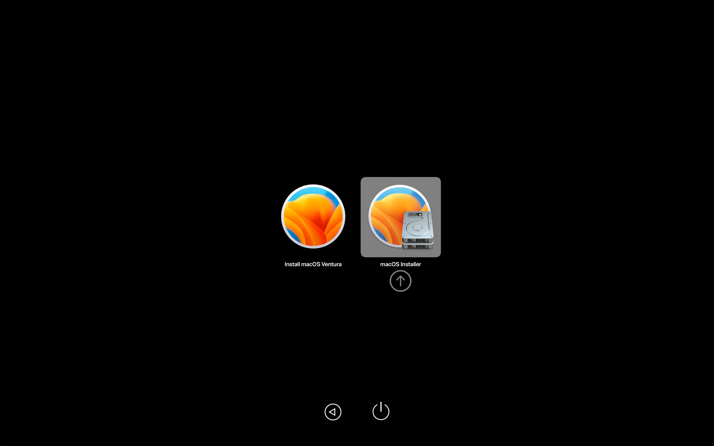

# Booting OpenCore and macOS

Now we finally get to boot OpenCore!

Reboot the machine while holding `Option` to select the EFI Boot entry with the OpenCore icon (holding the `Control` key will make this the default boot entry):

* This will be the Mac Boot Picker


::: details Note for Mac Pros/Xserves/iMacs with unflashed GPUs

(Adapted from the [OpenCore on the Mac Pro guide](https://forums.macrumors.com/threads/opencore-on-the-mac-pro.2207814/))

For Mac Pro, Xserve and, iMac users with non-flashed GPUs, you can still easily boot OpenCore and view the entire boot process.

Firstly, open the Terminal and run the following command:
```sh
sudo nvram "recovery-boot-mode=unused" && sudo reboot recovery
```
This will make your machine reboot into the Recovery Environment. Alternatively, holding `Command` + `R` when your machine is starting up will also let you enter the Recovery.

Secondly, open the Recovery Environment's Terminal (Menu bar > Utilities > Terminal).

Now you'll want to get a list of drive identifiers. To do so, run the following command:
```sh
diskutil list
```
The command should produce a list of drives installed in your system:


Keep track of the drive with the OCLP install. You will need the drive identifer for later.

Now you'll want to mount the EFI partition (where OCLP is installed, though it may differ if you've installed OCLP to a FAT-32 volume).

Run the following command (Replace X with the drive number):
```sh
diskutil mount diskXs1
```

If everything is correct, the EFI partion should be mounted.

Now you'll want to use the `bless` command to set the default boot device:
```sh
bless --mount /Volumes/EFI --setBoot --file /Volumes/EFI/System/Library/CoreServices/boot.efi
```
Once the command is run, it should produce no output.


If the command produces an output, ensure that you've typed it in correctly.

Now you can reboot your machine. OCLP is now the default boot option!
:::

Now that you've loaded OpenCore, "select Install macOS":

* This will be the OpenCore Picker


You will soon reach the installer screen! If you enabled verbose mode when building OCLP, a lot of text will run across the screen. From there, it's just like any normal macOS install. For an example of how the boot process looks, see the following video:

* [OpenCore Legacy Patcher Boot Process](https://www.youtube.com/watch?v=AN3zsbQV_n4)

If your Mac is looping back into the beginning of the setup after the first reboot, turn it off, start it again and hold `Option`. This time, select the option with a grey hard disk icon, it can say "macOS Installer" or the name you gave the disk during the installer process. Keep repeating this step after every reboot if necessary.




::: warning

**MacBookPro11,3 Note**: When booting macOS Monterey, you'll need to boot into safe mode if acceleration patches are not installed yet. [Otherwise, you'll hit a black screen due to missing NVIDIA drivers.](https://github.com/dortania/OpenCore-Legacy-Patcher/issues/522) Safe Mode can be entered by holding `Shift + Enter` when selecting macOS Monterey in OCLP's Boot Menu.

:::

::: warning 

**T1 Macs**: When installing macOS Sonoma or newer on a T1 system, full disk wipe will remove T1 functionality (touchbar etc). Therefore when installing, only wipe the volume containing the operating system.  

<div align="center">
             
</div>

[More info here](https://dortania.github.io/OpenCore-Legacy-Patcher/TROUBLESHOOTING.html#no-t1-functionality-after-installing-sonoma-or-newer)

:::


# Once installed and booting, head to [Post-Installation](./POST-INSTALL.md)

